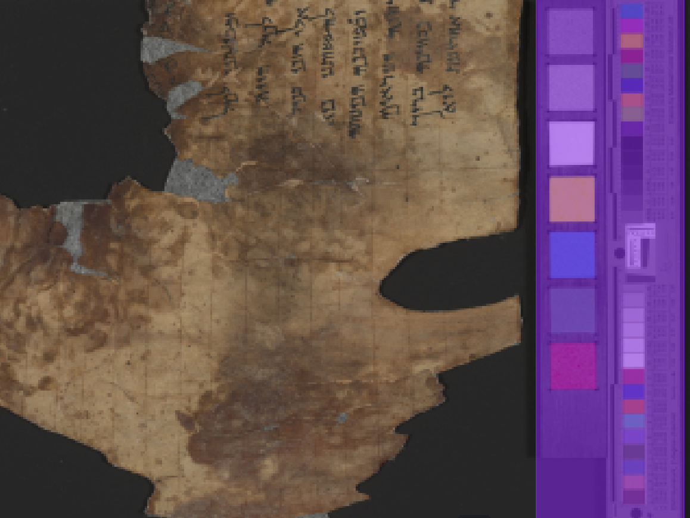
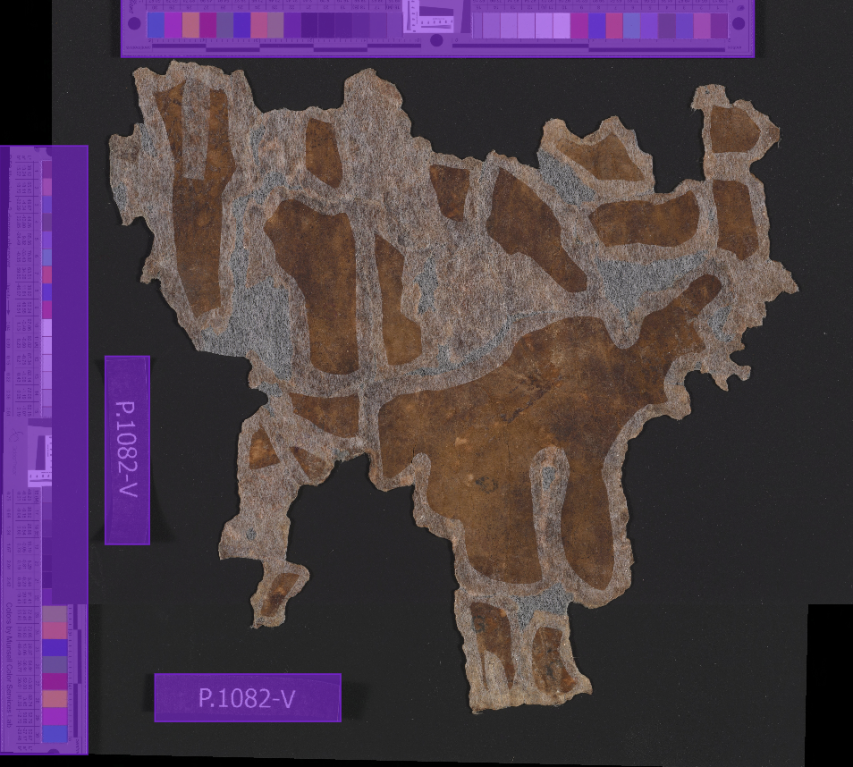
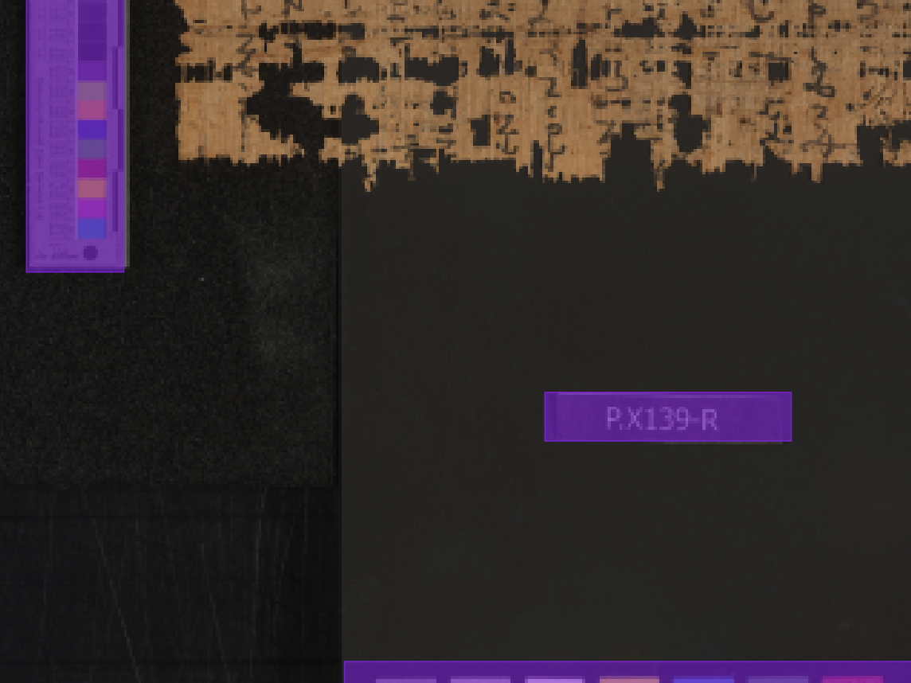

# qumran_segmenting_dead_sea_scroll_fragments_for_a_scientific_image_set
This repository contains the source code and dataset used in the paper "[Segmenting Dead Sea Scroll Fragments for a Scientific Image Set](https://arxiv.org/abs/2406.15692)" by [Bronson Brown-deVost](https://github.com/Bronson-Brown-deVost). 
The dataset include high-resolution images of Dead Sea Scroll fragments, along with corresponding ground-truth segmentation masks for evaluation purposes. The code and dataset can be used to reproduce the results of the paper, and can also serve as a starting point for further research in the field.

# Trained model for bar detection on the dead sea scroll fragment images

The trained bar detection model can be downloaded from [here](https://tauex-my.sharepoint.com/:u:/g/personal/berat_tauex_tau_ac_il/EQsbt9qn1P9KtuJmZ2ffJP8B_25gfLYuLarpgI1CU04alQ?e=8p1Dtx).

## Sample bar detection results





# Installation Gudie for HPC operated by the GWDG for both the Max Planck Society and the University of Göttingen

## Create the virtual environment at the front end node
```
module load anaconda3/2021.05
conda create -n my_env
source activate my_env
pip3 install torch torchvision torchaudio
module load gcc
python -m pip install 'git+https://github.com/facebookresearch/detectron2.git'
```

## Start an active shell at a GPU node
```
srun -p gpu -t 20 --gpus-per-node 1 --pty /bin/bash -i
```
## Load the modules and run the code at the GPU node
```
module load anaconda3/2021.05
module load gcc
module load cuda
source activate my_env
cd ~/code/find_masks/sqe_segmentation/bar_detection
python detect_bar.py
```

# Installation Guide for TAU servers

## Prerequisites

- CUDA 11.5
- Python 3.7

## Steps to Install

1. Check your CUDA version by typing the following command on your terminal:
    ```
    nvcc --version
    ```
   If your CUDA version is different than 11.5, consider updating the version or manually modifying the commands below to reflect the differences.

2. Create a virtual environment using conda with Python 3.7 and activate it:
    ```
    conda create --name torchenv python=3.7
    conda activate torchenv
    ```

3. Install PyTorch 1.12.1, torchvision 0.13.1, and torchaudio 0.12.1, with CUDA 11.3:
    ```
    conda install pytorch==1.12.1 torchvision==0.13.1 torchaudio==0.12.1 cudatoolkit=11.3 -c pytorch
    ```

4. Install OpenCV:
    ```
    conda install -c conda-forge opencv
    ```

5. Install JupyterLab:
    ```
    conda install jupyterlab
    ```

6. Install IPython kernel:
    ```
    conda install -c anaconda ipykernel
    ```

7. Install detectron2 from source using python pip:
    ```
    python -m pip install 'git+https://github.com/facebookresearch/detectron2.git'
    ```

8. Install setuptools:
    ```
    conda install setuptools==58.0.4
    ```

Once you have completed these installation steps, you should be ready to start using our project.
